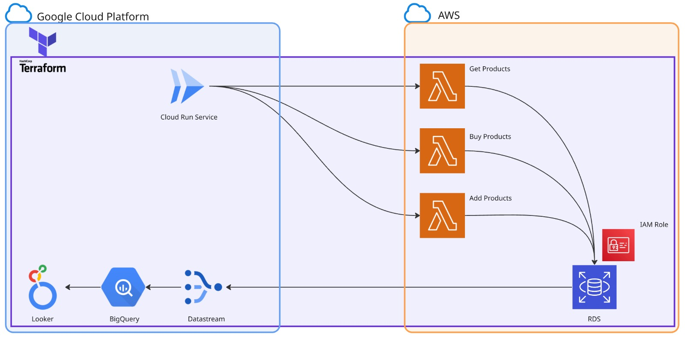

# Data Project 3 🚀

¡Bienvenido! Este proyecto muestra cómo desplegar una **aplicación multicloud** 100 % funcional, combinando lo mejor de AWS y Google Cloud para ofrecer un backend elástico y un frontend ligero.

---

## ⚙️ Arquitectura

A grandes rasgos, el sistema queda así:

> *(Funciona: al terminar el `terraform apply` tendrás la API operativa y la interfaz web lista para usar).*
> **TIP:** Justo debajo encontrarás un espacio para añadir tu diagrama de infraestructura en alta resolución.

<!-- 👉 Reemplaza la ruta con la de tu imagen -->



---

## 🗂️ Estructura del repositorio

| Ruta                                          | Descripción                                                   |
| --------------------------------------------- | ------------------------------------------------------------- |
| **`infra/`**                                  | Configuración **Terraform** que levanta todo lo necesario.    |
| **`modules/aws/`**                            | Código de las funciones **Lambda** y recursos auxiliares.     |
| **`modules/gcp/web/`**                        | Aplicación **Flask** preparada para contenedores y Cloud Run. |
| **`modules/schemas/rds_products_schema.sql`** | Esquema inicial y datos semilla de la base de datos.          |

---

## 🔑 Prerrequisitos

* **Terraform ≥ 1.4**
* **Docker** con *Buildx* habilitado (para las imágenes de Lambda y Cloud Run)
* **AWS CLI** con credenciales configuradas
* **Google Cloud SDK** autenticado en tu proyecto
* *(Opcional)* **Python 3.10+** si quieres arrancar la app Flask en local

---

## 📋 Variables necesarias (`terraform.tfvars`)

```hcl
# GCP
gcp_project          = "<TU‑PROYECTO>"

# AWS
aws_region           = "<eu-west-1 | us-east-1 | ...>"
account_id           = "<123456789012>"

# Replicación PostgreSQL → BigQuery
publication         = "<nombre_publication>"
replication_slot    = "<nombre_slot>"

datastream_user     = "<usuario_ds>"
datastream_password = "<password_ds>"

# Base de datos
rds_endpoint        = "<rds.endpoint.amazonaws.com>"
db_user             = "<usuario_rds>"
db_pass             = "<password_rds>"
```

> **Nota:** Copia `infra/terraform/terraform.tfvars` como punto de partida y rellena cada valor con los datos de tu entorno.

---

## 🚀 Despliegue con Terraform

```bash
cd infra/terraform
terraform init          # Inicializa el directorio
terraform plan          # (Opcional) Previsualiza los cambios
terraform apply         # ¡A volar!
```

Al concluir, tendrás:

* Una instancia **RDS PostgreSQL**.
* Tres **AWS Lambda** expuestas vía **API Gateway**.
* Configuración de **Datastream** replicando en **BigQuery** (opcional).
* Un servicio **Cloud Run** (`frontend`) con la interfaz web.

---

## 🖥️ Ejecutar el frontend en local

```bash
cd modules/gcp/web
python -m venv .venv && source .venv/bin/activate
pip install -r requirements.txt
python app.py
```

Abre [http://localhost:8080](http://localhost:8080) y listo.
Si tu endpoint de API Gateway difiere, actualiza la constante `BASE_URL` en `app.py`.

---

## 🌐 Acceso al Cloud Run desplegado

```bash
gcloud run services describe frontend \
  --region <REGION> \
  --format='value(status.url)'
```

Visita la URL resultante para disfrutar de la aplicación *hosted* en Cloud Run.

---

---

## 💬 Siguientes pasos

1. **Añade tu diagrama** donde indica la imagen para tener la foto completa de la arquitectura.
2. Personaliza la capa de datos o crea endpoints Lambda adicionales.
3. Conecta Datastream solo si necesitas análisis avanzado en BigQuery.

¡Y eso es todo! Con este proyecto tendrás una base sólida, probada y **funcionando** para experimentar con infra multicloud sin dolores de cabeza. ✨
